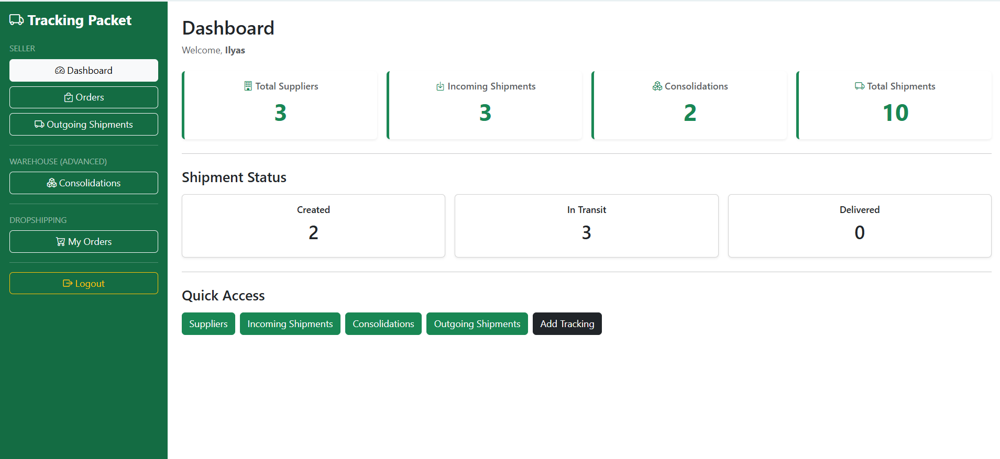
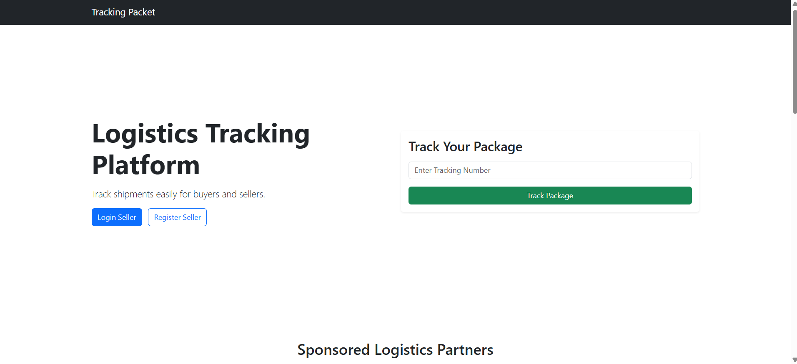

# Tracking Package

Web-based Logistics Tracking Platform built with PHP Native, MySQL, and Bootstrap 5.

## Live Demo

https://trackingpacket.infinityfree.io

## Features

- Seller Dashboard
- Shipment Tracking
- Consolidation Management
- Dropshipping Module
- Tracking Timeline
- Supplier Simulator
- Logistics Simulator

---

## Homepage



---

## User Tracking



---

## Tech Stack

- PHP Native
- MySQL
- Bootstrap 5
- InfinityFree Hosting

---

## Installation

1. Clone repository

```bash
git clone https://github.com/arulGo18/Tracking-Package.git
```

2. Import database

```sql
database/tracking_packet.sql
```

3. Configure database

```php
config/database.example.php
```

Rename to:

```php
config/database.php
```

4. Run using XAMPP

```
http://localhost/tracking-packet
```

---

## Project Modules

### Seller
- Manage Orders
- Manage Suppliers
- Manage Shipments
- Manage Consolidations

### Dropshipper
- View Orders
- Track Shipment Status
- View Tracking Timeline

### Simulator
- Customer Order Simulator
- Supplier Simulator
- Logistics Simulator
- Tracking Update Simulator

---

## Author

**Ilyas Yasin Nurulah**

Informatics Student

GitHub:
https://github.com/arulGo18
